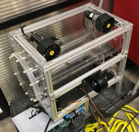

## Welcome to Robosub

Historically, the University of Texas at Dallas has placed among the top three in the AUVSI RoboSub competition. We intend to bring the team back to a competitive level and put UTD back on the leaderboard. Through our efforts and your generous support of our organization, we will inspire future UTD students to similarly pursue their interests and grow as students and Engineers. Furthermore, working on our team teaches students the valuable skill of how to work in a multidisciplinary team. 

## About the Team \\(^.^)/
**FACULTY**

- Jerry Alexander
- Nicholas Gans 
- Rod Wetterskog

**MEMBERS**

 *We have members ranging from freshman to graduate students of all different engineering majors.*

- Abhinav Chennapareddy
- Sabrina Banh 
- Eric Carter
- Ben Galicia 
- Eddie Bates
- Mayur Talole
- Amrr Okasheh
- Tam Nguyen
- Grant Carr
- Gary Liew
- Phyo P. Sone
- Abdul samad Kholia
- Pablo Peillard

## ULYSSES
The company’s ROV is named Ulysses after the U.S.S. submarine, and also after the submarine from the Disney movie Atlantis.

### Safety First 
* Emergency Shutoff

* Neutrally (slightly positive) buoyant

* No sharp corners

* All connections are soldered and a heat shrink was applied twice to ensure water tightness
 

### Special Features (O.o)
* High strength aluminum frame

* Waterproof interior for transportation of sensitive goods or electronics

* Neutrally buoyant for minimal control effort

* Controlled with off the shelf Xbox controller, easy to learn

* Rotating claw – can rotate objects or operate in horizontal or vertical configuration

* Stable in roll, controllable in pitch

* Can control 5 degrees of freedom

## COMPETITIONS 

### Marine Advanced Technology Education (MATE)  

Regional competition: May 13, 2017  
Location: San Jacinto College Maritme Technology & Training Center
 
Participating in the Ranger Class which has 4 stages 

- Commerce: Hyperloop Construction  
- Entertainment: Light and Water Show Maintenance
- Health: Environmental Cleanup  
- Safety: Risk Mitigation  

Robot will be tethered 

[MATE International ROV Competition](http://houston.marinetech2.org/)

[2017 Ranger Class ](http://www.marinetech.org/ranger_2017/)

### Robosub Nation: Robosub 

International competition: July 24-30, 2017  
Location: SSC Pacific TRANSDEC, San Diego, CA

Robot is autonomous 

AUV demonstrate its autonomy by 

- Following orange guide markers which will help direct the vehicle to the beginning tasks. 

- Two pingers will guide the AUV to the remaining two tasks. 
Vehicle will have to scuttle a ship (touch buoys)

- Navigate a channel (pass over an obstacle)

- Weigh anchor (drop a marker)

- Set course (fire torpedoes)

- Bury a treasure (retrieve object, surface, move/release object)

[Robonation: Robosub](http://www.robonation.org/competition/robosub)

[Teams Particpating in the competition](http://www.robonation.org/competition/robosub)

### Contact US 

_Robosub Email:_ [utdROBOSUB@gmail.com](mailto:utdROBOSUB@gmail.com)

_Project Manager:_ [stb150130@utdallas.edu](mailto:stb150130@utdallas.edu)

_Mechanical Engineer Lead:_ [eac160430@utdallas.edu](mailto:eac160430@utdallas.edu) 

_Electrical Engineer Lead:_  [abhinav.chennapareddy@utdallas.edu](mailto:abhinav.chennapareddy@utdallas.edu)

